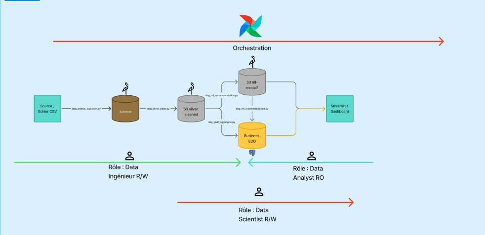

# Anime Analytics Pipeline

Projet data engineering autour de donnees MyAnimeList : ingestion CSV, nettoyage Spark, modele Gold dans Postgres, recommandations ALS et visualisation Streamlit.

Voici le lien pour retrouver le dataset : 
https://www.kaggle.com/datasets/CooperUnion/anime-recommendations-database

## Stack

- Docker Compose
- Apache Airflow
- Apache Spark
- MinIO
- PostgreSQL
- Streamlit

## Choix de la stack

- `Docker Compose` permet de lancer toute l'architecture localement avec une configuration reproductible.
- `Airflow` orchestre les etapes du pipeline et donne une vue claire des executions, erreurs et dependances.
- `Spark` traite les fichiers volumineux, notamment `rating.csv`, et permet de nettoyer, transformer et entrainer le modele ALS.
- `MinIO` simule un stockage objet compatible S3 pour organiser les donnees en couches `bronze`, `silver` et `ml-models`.
- `PostgreSQL` stocke la couche Gold sous forme analytique, avec contraintes, roles et index.
- `Streamlit` fournit une interface simple pour explorer les donnees et les recommandations.

## Architecture



L'architecture suit une logique de pipeline data par couches. Airflow orchestre
toutes les etapes, depuis les fichiers CSV sources jusqu'au dashboard Streamlit.

```text
Source CSV
  -> S3 bronze
  -> S3 silver cleaned
  -> Business BDD
  -> S3 ml-model
  -> recommendations
  -> Streamlit dashboard
```

Le flux se lit de gauche a droite :

- `Source CSV` : fichiers `anime.csv` et `rating.csv` places dans le dossier `data`.
- `S3 bronze` : zone brute dans MinIO. Les fichiers CSV sont copies tels quels, sans transformation.
- `S3 silver cleaned` : zone nettoyee dans MinIO. Spark lit le Bronze, nettoie les donnees et ecrit du Parquet.
- `Business BDD` : base PostgreSQL metier. Elle contient les tables Gold pretes pour l'analyse : dimensions, faits, bridge genres et recommandations.
- `S3 ml-model` : stockage du modele ALS entraine par Spark MLlib.
- `Streamlit Dashboard` : application de visualisation. Elle lit les tables Gold et les recommandations depuis PostgreSQL.

Airflow est place au-dessus du schema car il pilote l'ensemble du pipeline. Le
DAG `dag_full_pipeline` lance les etapes dans l'ordre :

```text
bronze -> silver -> gold -> ml
```

Les roles sont separes par usage :

- `Data Engineer` : ecrit les couches Bronze, Silver et Gold.
- `Data Scientist` : lit les donnees analytiques et ecrit les recommandations ML.
- `Data Analyst` : consulte les donnees via Streamlit en lecture seule.

Le DAG principal est `dag_full_pipeline`. Il est organise en groupes :

- `bronze` : upload des CSV vers MinIO
- `silver` : nettoyage Spark vers Parquet
- `gold` : chargement du modele analytique Postgres
- `ml` : entrainement ALS et generation des recommandations

Les DAGs separes restent disponibles pour rejouer une couche seule.

## Modele de tables


## Pourquoi un schema en etoile

La couche Gold utilise un schema analytique proche d'un star schema :

- `fact_ratings` contient les faits : les notes donnees par les utilisateurs aux animes.
- `dim_anime`, `dim_user` et `dim_genre` contiennent les dimensions d'analyse.
- `bridge_anime_genre` gere la relation many-to-many entre animes et genres.

Ce choix facilite les analyses :

- compter les notes par anime, utilisateur ou genre
- filtrer par type, genre, popularite ou note
- alimenter Streamlit avec des requetes SQL simples
- garder une separation claire entre faits et dimensions

Le bridge est necessaire car un anime peut avoir plusieurs genres, et un genre peut appartenir a plusieurs animes.

## Configuration

Creer le fichier `.env` depuis l'exemple :

```powershell
Copy-Item .env_exemple .env
```

Puis modifier les mots de passe.

## JARs Spark

Creer le dossier `spark/jars` :

```powershell
New-Item -ItemType Directory -Force spark/jars
```

Telecharger les JARs necessaires pour MinIO/S3A et PostgreSQL :

```powershell
Invoke-WebRequest -Uri "https://repo1.maven.org/maven2/org/apache/hadoop/hadoop-aws/3.3.4/hadoop-aws-3.3.4.jar" -OutFile "spark/jars/hadoop-aws-3.3.4.jar"
Invoke-WebRequest -Uri "https://repo1.maven.org/maven2/com/amazonaws/aws-java-sdk-bundle/1.12.262/aws-java-sdk-bundle-1.12.262.jar" -OutFile "spark/jars/aws-java-sdk-bundle-1.12.262.jar"
Invoke-WebRequest -Uri "https://repo1.maven.org/maven2/org/wildfly/openssl/wildfly-openssl/1.0.7.Final/wildfly-openssl-1.0.7.Final.jar" -OutFile "spark/jars/wildfly-openssl-1.0.7.Final.jar"
Invoke-WebRequest -Uri "https://repo1.maven.org/maven2/org/postgresql/postgresql/42.7.3/postgresql-42.7.3.jar" -OutFile "spark/jars/postgresql-42.7.3.jar"
```

## Lancement

```powershell
docker compose up -d --build
```

Verifier les services :

```powershell
docker compose ps
```

Interfaces :

- Airflow : http://localhost:8085
- Streamlit : http://localhost:8501
- MinIO console : http://localhost:9001
- Spark master : http://localhost:8080

Airflow est initialise avec :

- utilisateur : `admin`
- mot de passe : `admin`

## Execution du pipeline

Dans Airflow, lancer manuellement :

```text
dag_full_pipeline
```

Ordre d'execution :

```text
bronze -> silver -> gold -> ml
```

## Roles

Postgres metier utilise trois roles applicatifs :

- `data_engineer` : ecriture des tables Gold
- `data_scientist` : lecture Gold et ecriture des recommandations
- `data_analyst` : lecture seule pour Streamlit

MinIO cree aussi des utilisateurs/policies pour les usages data engineer et data scientist.

Cette separation limite les droits de chaque usage :

- les jobs Gold utilisent `data_engineer`, qui peut charger les tables analytiques
- le job ML utilise `data_scientist`, qui peut lire la Gold et ecrire les recommandations
- Streamlit utilise `data_analyst`, qui est en lecture seule

Ainsi, l'application de visualisation ne peut pas modifier les donnees, et le modele ML ne possede pas les memes droits que les traitements d'ingestion Gold.

## Gestion des erreurs d'insertion

Les jobs Gold et ML n'ecrivent plus directement dans les tables finales.

Flux utilise :

```text
validation Spark
  -> lignes invalides dans reject_records
  -> lignes valides dans stg_*
  -> remplacement transactionnel de la table finale
```

Si une erreur arrive pendant le remplacement final, Postgres rollback la transaction.

Si une ligne ne peut pas etre inseree, elle n'est pas envoyee directement dans la table finale. Spark la separe avant l'ecriture et l'enregistre dans `reject_records` avec :

- le nom du job
- la table cible
- la raison du rejet
- la ligne d'origine sous forme de payload
- la date du rejet

Exemples de rejets :

- cle primaire manquante
- doublon sur une cle primaire
- anime absent de `dim_anime` pour une table avec cle etrangere
- genre absent de `dim_genre`

Les lignes valides continuent d'etre chargees. Les lignes invalides restent consultables dans Postgres pour analyse.

Le remplacement final est transactionnel : les donnees valides sont d'abord chargees dans une table `stg_*`, puis Postgres remplace la table finale dans une transaction. Si cette etape echoue, le rollback evite de laisser une table finale dans un etat partiellement charge.

Important : les scripts `postgres/init/*.sql` ne sont executes automatiquement que lors de la creation du volume Postgres. Si la base existe deja et que de nouvelles tables ont ete ajoutees, il faut appliquer le SQL manuellement ou recreer le volume metier.

## Recommandations ALS

Le projet utilise ALS, pour `Alternating Least Squares`, un algorithme de recommandation collaboratif.

L'idee est de partir de la matrice utilisateurs/animes :

```text
utilisateur x anime -> note
```

Cette matrice est tres incomplete, car chaque utilisateur ne note qu'une petite partie des animes. ALS apprend des facteurs latents pour representer :

- les preferences des utilisateurs
- les caracteristiques implicites des animes

Ensuite, le modele estime quelles notes un utilisateur pourrait donner a des animes qu'il n'a pas encore notes. Les meilleurs scores deviennent les recommandations.

Dans le pipeline :

- `ml_01_train_als.py` entraine le modele sur les notes non nulles
- le modele est sauvegarde dans MinIO
- `ml_02_generate_recommendations.py` genere les top recommandations par utilisateur
- les animes deja notes sont exclus
- les resultats sont ecrits dans la table `recommendations`

## Donnees attendues

Les fichiers suivants doivent exister :

```text
data/anime.csv
data/rating.csv
```

## Commandes utiles

Redemarrer Airflow apres modification de DAG :

```powershell
docker compose restart airflow-scheduler airflow-webserver
```

Redemarrer Streamlit apres modification d'une page :

```powershell
docker compose restart streamlit
```

Voir les logs d'un service :

```powershell
docker compose logs -f airflow-scheduler
```

Arreter les services :

```powershell
docker compose down
```

Arreter et supprimer les volumes :

```powershell
docker compose down -v
```

Attention : `docker compose down -v` supprime les donnees Postgres et MinIO.
